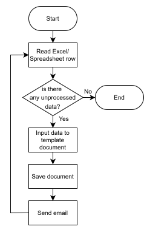

# Bellatrix Sampe Rompon

IT Developer with experience in developing and implementing RPA bots in finance, banking, human resource, and insurance sectors. Have solid understanding in machine learning, artificial intelligence, and IoT. Expert in all phase of SDLC process from analysis, design, deployment, and maintenance. Have good problem solving, strong analytical skills, and can work in a team.

## RPA Projects

### Document Bots

**Developed using UiPath**

RPA bots to automate the process of creating several documents. Bot will read every row in excel/spreadsheet using **Excel Activities** or **Google Workspace**. If there is data that are not processed yet, bot will get the data and put it in variables. After that, bot will open the template document in word and insert the variables into document using **Word Activities**. The document then will be saved in local folder. That process will be repeated until all the data in excel/spreadsheet completed. 

 
 
 
 
 
 
 

### Document Bots (Using OCR)

 

**Developed using UiPath** 

The bot will read all emails that has been sent on specified date. If bot got the email that the subject fits with specific format, bot will download the document attached to that email. All the activities in email is automated using **Email Activities**. Then, bot will extract the data from that document using **UiPath OCR** and save the data into excel. The data will be inserted into template document in word using **Word Activities**. After the word document is saved, bot then will sent that document via email.

 
 
 
 
 
 
 
 
 
 
 
 
 
 
 
 

### Application Automation Bot (Tax Application)

 

**Developed using UiPath** 

RPA bot to automate the process of inputting data into the tax application. The bot will get data from Excel using **excel activities** and put it in variables. The data then will be entered based on specified menu using various activities from **UI Automation Activities**, such as **click, check, type, get**, etc.

 
 
 
 
 
 
 

### SEO Ranking Bot

 

**Developed using UiPath** 

RPA bots to automate the process of calculating the ranking of each article from the company. To open the search engine, the bot uses the activity **open browser** from **UI Automation Activities**. For the search process on Google, bot use various activities from **UI Automation Activities** such as **type** and **click**. The bot will calculate the ranking of the article using **loop**.

 
 
 
 
 
 
 
 
 

### Websites Automation Bot for Insurance Company

 

**Developed using UiPath** 

RPA bots to automate the process for canceling customer policies at an insurance company. The bot will retrieve data from Excel using **excel activities**. The bot will access the website for using **open browser** from **UI Automation Activities**. Data in Excel will be input on the website using various activities from **UI Automation Activities** such as **click, check, type, get**, etc. The results of the policy cancellation process will be recorded into the excel.

 
 
 
 
 
 
 
 
 
 
 
 
 
 
 
 

### Reporting Bot for Banking Company

 

**Developed using Automation Anywhere (AA360)**

RPA Bot to automate the data comparison process on e-Statements and core banking websites. To access the e-Statement website and core banking website, the bot use actions from the **browser package**. The PDF e-Statement from the website will be downloaded and converted into txt using the **extract text** action from the **pdf package**. The data in the e-Statement then compared with the data on the core banking website using **if logic** and **fuzzy match package**. The comparison results will be recorded in Excel using **Excel Advanced Package**.

 
 
 
 
 
 
 
 
 
 
 
 

### Settlement Process Bot for Banking Company

 

**Developed using Automation Anywhere (AA360)**

RPA Bot to automate settlement process. The bot will read the email and download the attachments using various actions from the **email package**. Excel and txt files from emails will be put into a folder using the action from **folder package**. The contents of Excel will be moved to the Excel logbook using various actions from the **Excel Advanced Package**. The robot then open the first website and input the data using actions from **browser package**. Next, the robot accesses the second website input related data and then saved the output in specified folder. The output will be sent back to the requestor via email & FTP.
